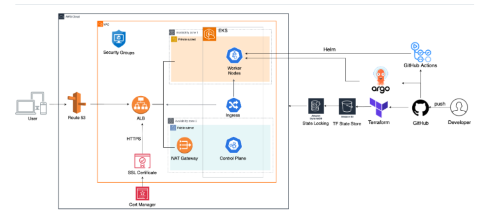
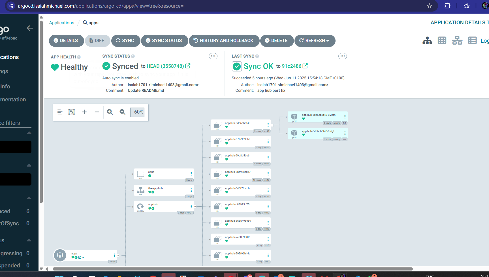
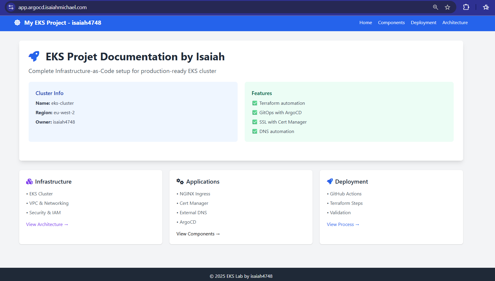
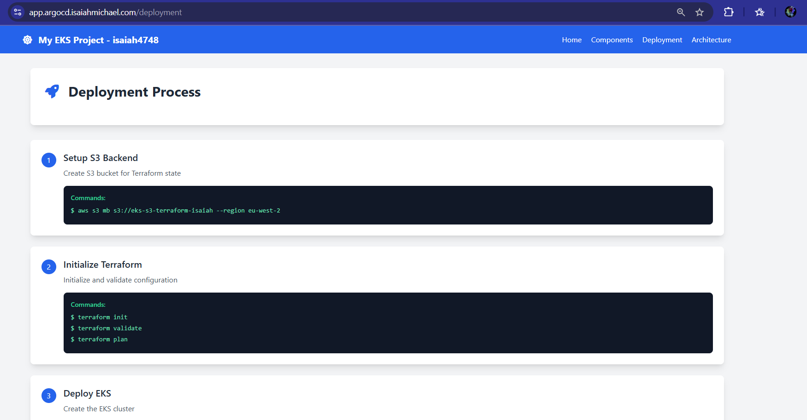
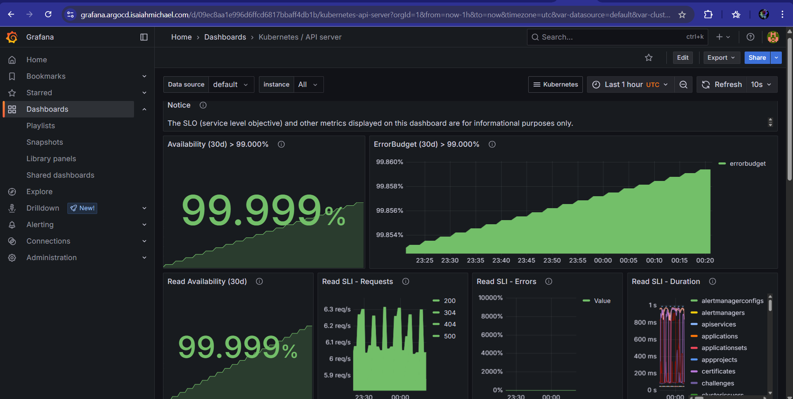
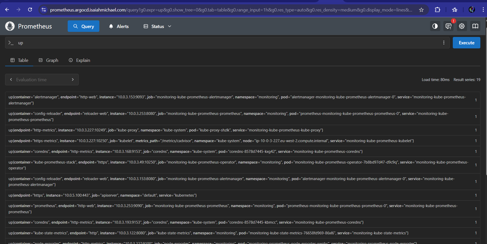
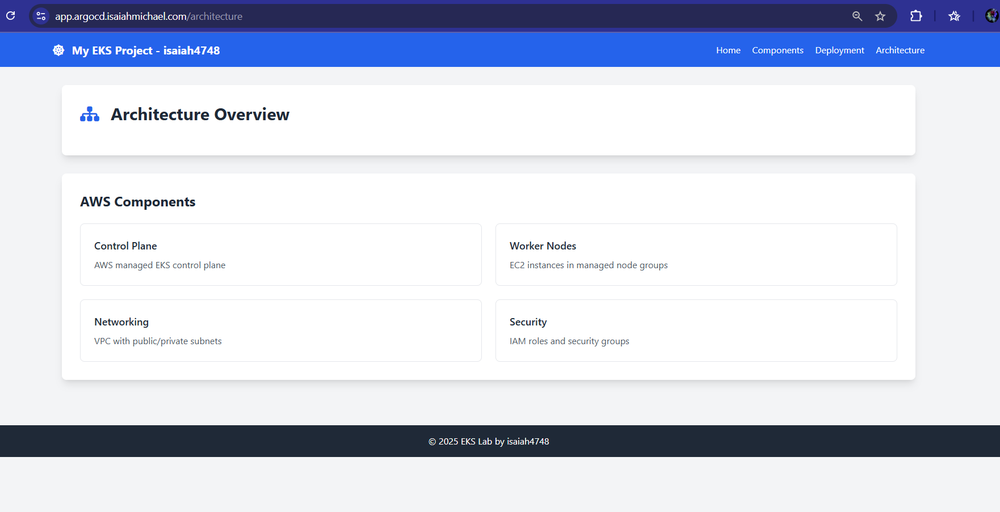
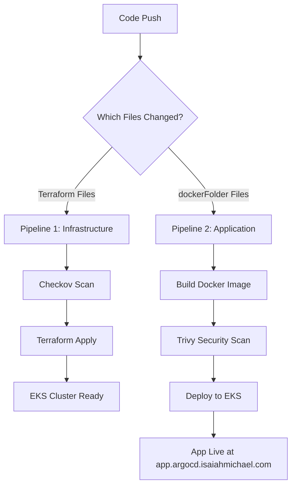

# EKS Cluster Infrastructure Deployment with GitOps, CI/CD, Security, and Monitoring

## Overview  
This project provisions a production-ready Kubernetes cluster on AWS using EKS (Elastic Kubernetes Service). The cluster is used to securely host a containerized website, managed entirely through infrastructure-as-code and GitOps workflows.

The setup reflects real-world DevOps practices: automated deployments, continuous monitoring, secure configurations, and full traceability — built for reliability and maintainability in a production context.

---

## Key Features

- Amazon EKS  
  A fully managed Kubernetes platform on AWS ☁️, used here to run the web application with built-in scaling, high availability, and native AWS service integration.

- Terraform Infrastructure as Code  
  Modular Terraform code 📦 provisions all infrastructure components — including VPC, IAM roles, EKS cluster — with remote state stored in S3 and locking via DynamoDB.

- CI/CD Pipelines  
  - Pipeline 1 validates, plans, and applies Terraform configurations with automated error handling ⚙️.  
  - Pipeline 2 handles:
    - Checkov 🔍 for static analysis of Terraform security and compliance.
    - Docker image builds 🛠️ and publishing to Amazon ECR.
    - Trivy 🧪 to scan images for vulnerabilities.
    - Deployment to EKS using Kubernetes manifests 🚀.

- GitOps with ArgoCD  
  ArgoCD syncs application state from Git to the cluster 🔁. This powers consistent, version-controlled updates to the website with no manual intervention.

- Helm Charts  
  Used to install and configure Kubernetes tools like ArgoCD, Cert-Manager, Prometheus, and Grafana 🧩 — making the environment easy to reproduce.

- Cert-Manager  
  Handles HTTPS certificate issuance and renewal automatically 🔐 via Let’s Encrypt, securing public-facing services without manual effort.

- ExternalDNS  
  Automatically manages DNS records in AWS Route 53 🌍 based on Kubernetes ingress resources — keeping domain routing up to date during deployments.

- Prometheus and Grafana  
  Delivers observability 📊 with real-time metrics collection and dashboards tracking pod health, resource usage, and system performance.

- RBAC (Role-Based Access Control)  
  Access to the cluster is restricted 🛡️ using namespace-level and cluster-wide permissions, following least privilege principles.

---


# Architecture 

## System Overview


The overall architecture shows the complete EKS deployment with GitOps, monitoring, and security components integrated across AWS services.

## Component Diagrams

### ArgoCD GitOps Management

Illustrates how ArgoCD manages application deployments through Git-based workflows, automatically syncing repository changes to the EKS cluster.

### Application Website & Components

Shows the main Flask application architecture hosted at app.argocd.isaiahmichael.com with its various components and microservices.


Details the individual components that make up the application stack, including backend services, databases, and API endpoints.

### Application Deployment Pipeline

Shows the CI/CD pipeline flow from code commit through security scanning, Docker image building, and Kubernetes deployment for the Flask application and its subdomains (/deployment, /api, etc.).

### Monitoring Infrastructure


Displays the monitoring architecture with Grafana providing real-time dashboards for application and infrastructure metrics collected by Prometheus.


Shows how Prometheus scrapes metrics from various Kubernetes components, the Flask application, and infrastructure to provide comprehensive observability.

### Application Architecture & Infrastructure

Comprehensive view of how the Flask application integrates with the EKS infrastructure, including load balancers, ingress controllers, and backend services.

### Key Architectural Components

**Control Plane (AWS Managed)**
- EKS master nodes managed by AWS
- API server, etcd, scheduler, and controller manager

**Data Plane (Customer Managed)**
- EC2 worker nodes in private subnets
- Flask application pods and system components
- Load balancers and ingress controllers

**Application Layer**
- Flask web application at app.argocd.isaiahmichael.com
- Multiple endpoints and subdomains (/deployment, /api, /health)
- Docker containerized microservices

**GitOps Layer**
- ArgoCD for declarative deployments
- Git repositories as single source of truth
- Automated synchronization and rollback capabilities

**Security & Access**
- IAM roles and service accounts (IRSA)
- RBAC for fine-grained permissions
- Network policies and security groups

**Observability Stack**
- Prometheus for metrics collection from Flask app and infrastructure
- Grafana for visualization and application monitoring
- Centralized logging and performance tracking

**Automation & DNS**
- Cert-Manager for automatic SSL/TLS certificates
- ExternalDNS for dynamic DNS record management
- Helm for package management and application deployments

# Why This Setup Adds Real Value in a Production Environment

ArgoCD for Reliable, Versioned Deployments  
ArgoCD enables consistent, auditable deployments directly from Git. It reduces manual errors, supports rollback, and fits cleanly into CI/CD workflows for team-based delivery.

EKS for Scalability and AWS Integration  
Using Amazon EKS provides a managed, production-grade Kubernetes environment. It handles scaling and availability out of the box, while integrating with other AWS services like IAM, VPC, and CloudWatch.

HTTPS and Access Control Built In  
Cert-Manager automates certificate management using Let’s Encrypt, removing the need for manual renewal or provisioning. RBAC is used to control access at both the namespace and cluster level.

CI/CD Pipelines with Security Checks  
Pipelines are set up to:
- Scan Terraform code with Checkov for misconfigurations  
- Build and push Docker images to ECR  
- Scan those images with Trivy before deployment  
- Deploy to EKS via Kubernetes manifests  
This approach helps catch security issues early and keeps deployments consistent.

Automated DNS with ExternalDNS  
ExternalDNS integrates with Route 53 to update DNS records automatically based on Kubernetes ingress changes. It removes the need for manual updates and speeds up deployments.

Monitoring with Prometheus and Grafana  
Prometheus collects application and infrastructure metrics, and Grafana displays them in real-time dashboards. This makes it easier to track performance and catch issues before they impact users.


# Infrastructure Components
VPC (Virtual Private Cloud): Provides a secure, isolated network environment for the cluster .
EKS (Elastic Kubernetes Service): Manages the Kubernetes control plane and worker nodes.
ArgoCD: Manages application deployments based on Git repositories.
Helm: Deploys and manages Kubernetes resources using Helm charts.
Cert-Manager: Handles SSL/TLS certificate issuance and renewal.
ExternalDNS: Automates DNS record updates in AWS Route 53.


# CI/CD Pipeline Architecture

This project implements two complementary GitHub Actions workflows that automate infrastructure provisioning, security scanning, and application deployment.

## Pipeline 1: Infrastructure Validation & Deployment
**File:** `.github/workflows/terraformValidate.yaml`

### What it does:
This pipeline handles the **infrastructure layer** - creating and managing your EKS cluster and AWS resources.

### Workflow Steps:
1. **Security Scanning with Checkov** 🔍
   - Scans Terraform code for misconfigurations and security violations
   - Checks for AWS best practices (encrypted storage, proper IAM, etc.)
   - **Continues deployment even if issues found** (warnings only)

2. **Terraform Infrastructure Management** 🏗️
   - **Validates** Terraform syntax and configuration
   - **Plans** changes to show what will be created/modified
   - **Applies** changes to provision EKS cluster, VPC, IAM roles, etc.
   - Uses **S3 backend** for state management with **DynamoDB locking**

3. **Error Handling** ⚠️
   - Gracefully handles existing resources
   - Continues workflow even if some steps fail
   - Provides detailed status summaries

### Triggers:
- Pushes to `main` or `addCICD` branches
- Changes to any Terraform files

---

## Pipeline 2: Application Build & Deployment
**File:** `.github/workflows/dockerDeploy.yaml`

### What it does:
This pipeline handles the **application layer** - building, scanning, and deploying your Flask web application.

### Workflow Steps:
1. **Docker Image Build** 🐳
   - Builds Docker image from `dockerFolder/`
   - Tags with commit SHA for version tracking
   - Pushes to **Amazon ECR** (Elastic Container Registry)

2. **Security Scanning with Trivy** 🧪
   - Scans Docker images for vulnerabilities
   - Checks for known CVEs in dependencies
   - Reports **CRITICAL, HIGH, MEDIUM, LOW** severity issues
   - **Never blocks deployment** (security awareness, not gates)

3. **Kubernetes Deployment** 🚀
   - Updates Kubernetes manifests with new image tag
   - Applies manifests directly to EKS cluster
   - Forces pod restart to pull new image
   - Waits for successful rollout

### Triggers:
- Pushes to `main` branch
- **Only when files in `dockerFolder/` change**

---

## Pipeline Integration Flow



## Key Pipeline Features

### Security-First Approach 🔒
- **Checkov** scans infrastructure code for AWS security best practices
- **Trivy** scans container images for known vulnerabilities
- Both tools provide **warnings without blocking** deployment

### Automated State Management 📊
- Terraform state stored in **S3** with **DynamoDB locking**
- Prevents concurrent modifications and state corruption
- Enables team collaboration on infrastructure

### Direct Deployment (Not GitOps) ⚡
- Pipeline 2 uses **direct kubectl deployment**
- Updates manifests and applies immediately
- **Note:** This bypasses ArgoCD - could be converted to GitOps by committing manifest changes instead

### Environment Isolation 🏗️
- Each pipeline has specific triggers and permissions
- Infrastructure and application deployments are independent
- Supports different development workflows

### Production Considerations 🚀
In a production environment, you might want to:
- Convert Pipeline 2 to GitOps (commit manifest changes for ArgoCD to sync)
- Add approval gates for production deployments
- Implement vulnerability thresholds that block deployment
- Add comprehensive testing stages

This dual-pipeline approach provides **infrastructure-as-code automation** with **continuous application deployment**, while maintaining security visibility throughout the process.


# Setup instructions 

1. Clone the Repository
git clone [repo-url]
cd [repo-directory]

 2. Provision EKS Cluster with Terraform
terraform init
terraform plan
terraform apply


3. Configure kubectl
aws eks --region <region> update-kubeconfig --name <cluster-name>
kubectl get nodes


4. Configure argocd via helm
Add the ArgoCD Helm repository
helm repo add argo https://argoproj.github.io/argo-helm
helm repo update

Install ArgoCD using your values file
helm install argocd argo/argo-cd \
  --namespace argo-cd \
  --values helm-values/argocd.yaml


5. Install cert-manager

```bash
# Create cert-manager namespace
kubectl create namespace cert-manager

# Add cert-manager Helm repository
helm repo add jetstack https://charts.jetstack.io
helm repo update

# Install cert-manager with CRDs
helm install cert-manager jetstack/cert-manager \
  --namespace cert-manager \
  --values helm-values/cert-manager.yaml \
  --set crds.enabled=true

# Wait for cert-manager pods to be ready
kubectl wait --for=condition=ready pod -l app.kubernetes.io/name=cert-manager -n cert-manager --timeout=300s

# Create Let's Encrypt cluster issuer
kubectl apply -f helm-values/letsencrypt-clusterissuer.yaml

# Verify installation
kubectl get pods -n cert-manager
kubectl get clusterissuer letsencrypt-prod
```

**Expected output:**
- All cert-manager pods should be `Running`
- ClusterIssuer should show `READY: True`

**Get ArgoCD admin password:**
```bash
kubectl -n argo-cd get secret argocd-initial-admin-secret \
  -o jsonpath="{.data.password}" | base64 -d
echo
```

**Access your applications:**
- ArgoCD: https://argocd.isaiahmichael.com (admin / password-from-above)
- Certificates will be automatically issued for all ingresses!

5. Install Prometheus and Grafana

```bash
# Create monitoring namespace
kubectl create namespace monitoring

# Add Prometheus community Helm repository
helm repo add prometheus-community https://prometheus-community.github.io/helm-charts
helm repo update

# Install Prometheus and Grafana stack
helm install monitoring prometheus-community/kube-prometheus-stack \
  --namespace monitoring \
  --values helm-values/prometheus.yaml

# Wait for all pods to be ready
kubectl wait --for=condition=ready pod -l app.kubernetes.io/name=grafana -n monitoring --timeout=300s
kubectl wait --for=condition=ready pod -l app.kubernetes.io/name=prometheus -n monitoring --timeout=300s

# Apply ingresses for external access
kubectl apply -f apps/monitoring-ingress.yaml

# Verify installation
kubectl get pods -n monitoring
kubectl get ingresses -n monitoring
kubectl get certificates -n monitoring
```

**Expected output:**
- All monitoring pods should be `Running`
- Ingresses should have ADDRESS assigned
- Certificates should show `READY: True`

**Access your monitoring:**
- Grafana: https://grafana.argocd.isaiahmichael.com
  - Username: `admin`
  - Password: `admin123` (from your prometheus.yaml config)
- Prometheus: https://prometheus.argocd.isaiahmichael.com

**Verify certificates are working:**
```bash
# Check certificate status
kubectl get certificates -n monitoring

# Should show:
# grafana-tls      True    grafana-tls      
# prometheus-tls   True    prometheus-tls   
```
6. Install cert-manager

```bash
# Create cert-manager namespace
kubectl create namespace cert-manager

# Add cert-manager Helm repository
helm repo add jetstack https://charts.jetstack.io
helm repo update

# Install cert-manager with CRDs
helm install cert-manager jetstack/cert-manager \
  --namespace cert-manager \
  --values helm-values/cert-manager.yaml \
  --set crds.enabled=true

# Wait for cert-manager pods to be ready
kubectl wait --for=condition=ready pod -l app.kubernetes.io/name=cert-manager -n cert-manager --timeout=300s

# Create Let's Encrypt cluster issuer
kubectl apply -f helm-values/letsencrypt-clusterissuer.yaml

# Verify installation
kubectl get pods -n cert-manager
kubectl get clusterissuer letsencrypt-prod
```

**Expected output:**
- All cert-manager pods should be `Running`
- ClusterIssuer should show `READY: True`

**Get ArgoCD admin password:**
```bash
kubectl -n argo-cd get secret argocd-initial-admin-secret \
  -o jsonpath="{.data.password}" | base64 -d
echo
```

**Access your applications:**
- ArgoCD: https://argocd.isaiahmichael.com (admin / password-from-above)
- Certificates will be automatically issued for all ingresses!


7. Install ExternalDNS

```bash
# Create external-dns namespace
kubectl create namespace external-dns

# Add ExternalDNS Helm repository
helm repo add external-dns https://kubernetes-sigs.github.io/external-dns/
helm repo update

# Install ExternalDNS for Cloudflare
helm install external-dns external-dns/external-dns \
  --namespace external-dns \
  --values helm-values/external-dns.yaml

# Verify installation
kubectl get pods -n external-dns
kubectl logs -n external-dns deployment/external-dns --tail=20
```

**Expected output:**
- ExternalDNS pod should be `Running`
- Logs should show DNS records being created/updated

**Result:** All ingresses will automatically get DNS records in Cloudflare! 🌐 
**Note:**  A cloudflare API key is required for External DNS via Cloudflare!


8. Clean up resources 

```bash

terraform destroy
```
